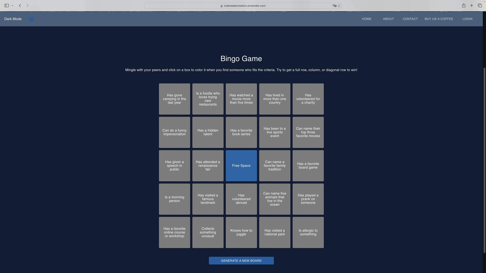
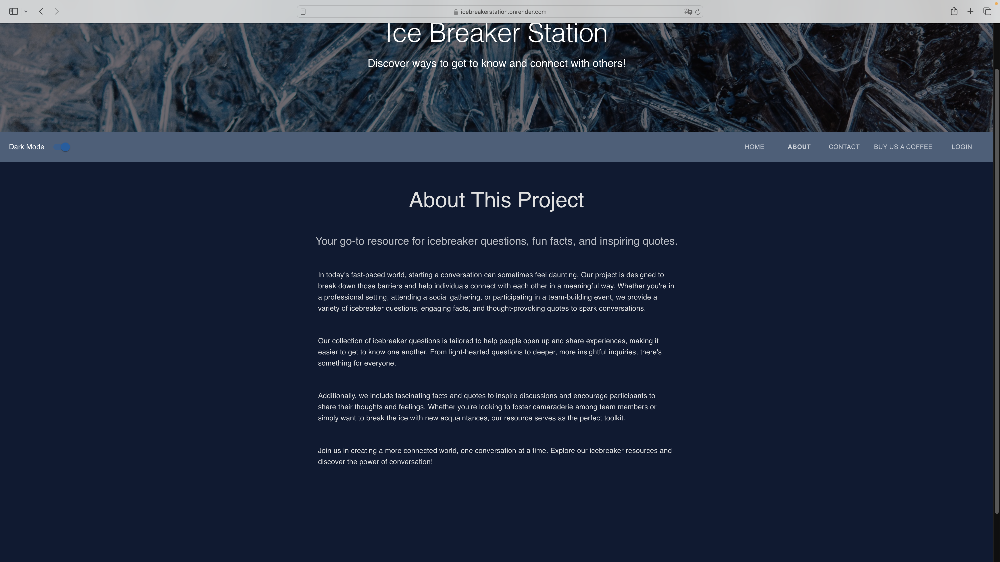
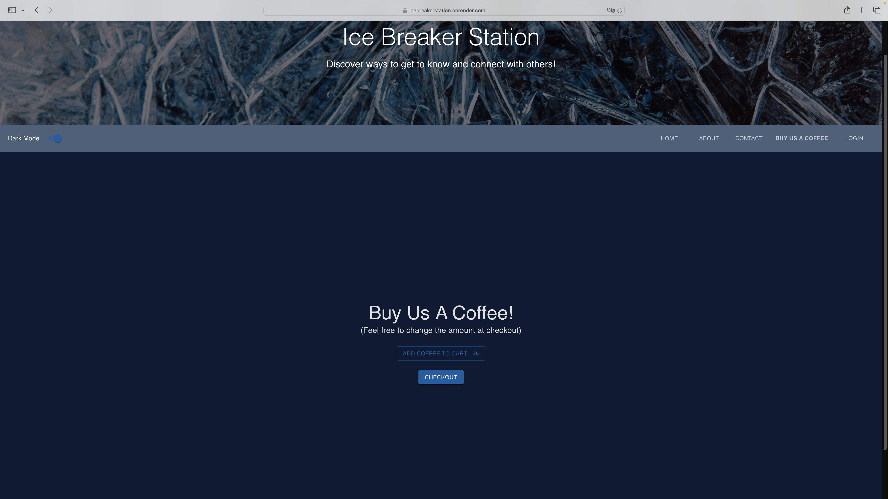
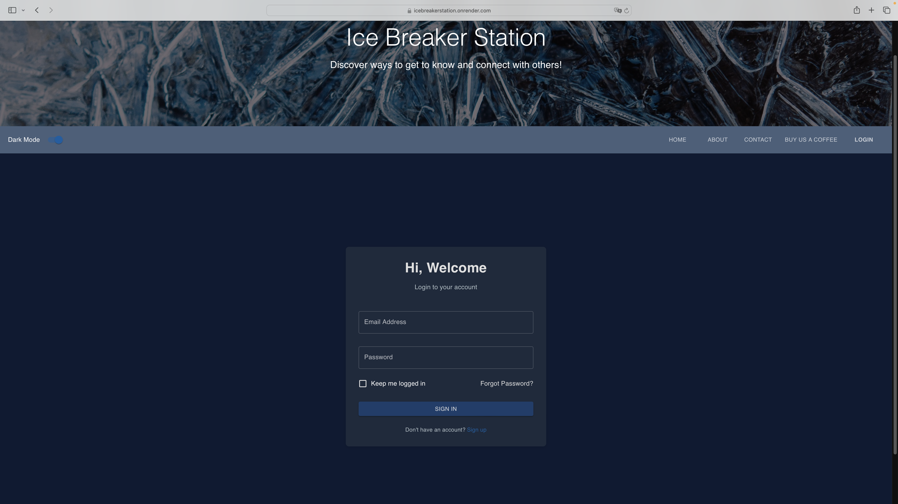
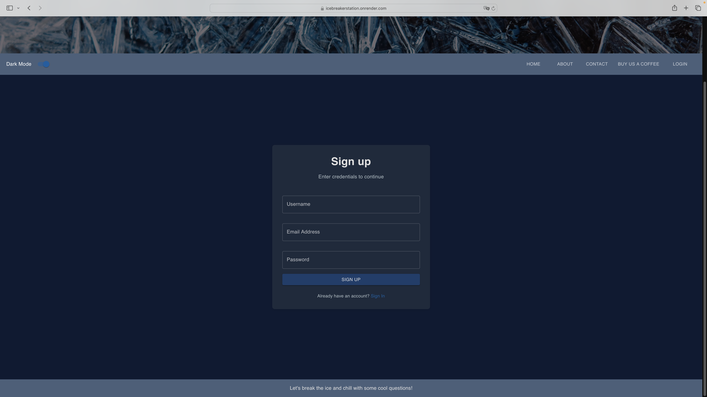

# Icebreaker Station

## Description

This project was created to give employers and employees a fun way to get to know each other. Many companies use ice breakers to help new employees and old employees alike to get to know each other, but there are only so many ice breakers that are shown on certain internet sites. We wanted to create a website that had a plethora of different ways to break the ice, thus creating Icebreaker Station. This website has multiple options to choose from like normal icebreaker questions, jokes, would you rather questions, dumb laws, and even a bingo board. This will allow companies to have quick and easy access to various types of icebreakers for their meeting or staff get togethers. This project taught us a lot when it came to creating the code and also trying to deploy the code. Using graphQL was a learning curve, as well as delpoying a site that had to use MongoDB Atlas, as that was not something we had worked with before. Integrating Stripe into our build was also pretty difficult, but we were able to work through it together. 

## Usage

To use this website, you just need to pull up the site and you can follow the tabs to pick whatever type of icebreaker you would like to use. If you would like to favorite any of the icebreakers you find, you can create an account throuhg the login page and choose sign up. Once you are logged in, you can add favorites and also delete them. There is also an option to buy us a coffee, if you're feeling generous, by using the buy us a coffee tab on the top right hand side. There is also an option to change the colors from dark mode to light mode by clicking the toggle button on the top left hand side of the page. 

```md

```

```md

```

```md

```

```md

```

```md

```

```md

```

```md

```

```md

```

```md

```

```md

```

```md

```

```md

```

```md

```

```md

```

## Credits

This project was created by Valya Srizheus (https://github.com/valyastriz), Kendra DeFrancisco (https://github.com/defrak2), Ashley Wright (https://github.com/ajwmp93), and we had help from our instructors as well as ChatGPT.